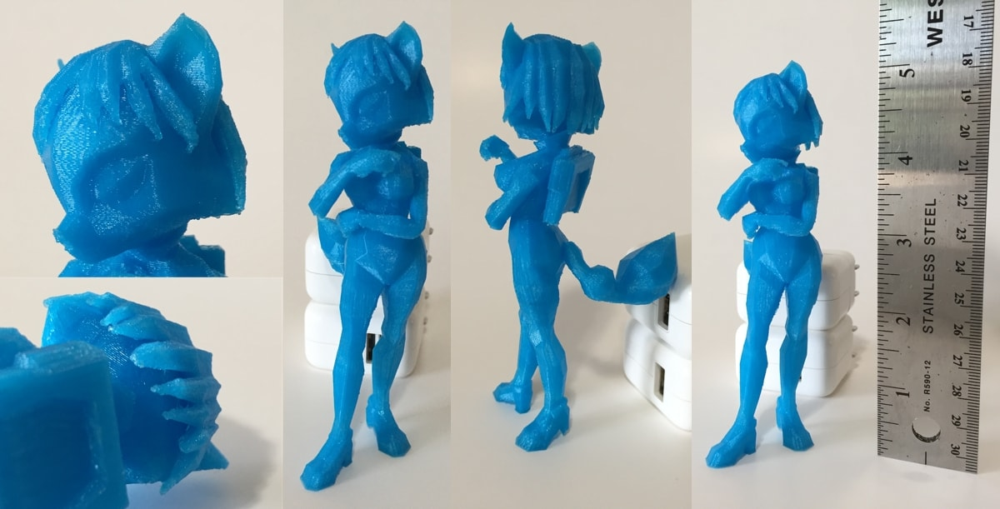

# 3D Printable Krystal Trophy from Smash 4

A 3D printable version of Krystal inspired by her trophy pose in Super Smash Bros for Wii U.

Originally based on a mesh ripped from Super Smash Bros for Wii U by ThatTrueStruggle ([The Models Resource Page](https://www.models-resource.com/wii_u/supersmashbrosforwiiu/model/10550/)).

This project was originally announced via the [Krystal Archive on June 10th, 2017](https://krystalarchive.com/2017/06/3d-printable-krystal-version-1-0/).

### [Solid Version](solid/) • [Changelog](CHANGELOG.md) • [License](LICENSE.md)

## Technical Fixes

* Adjusted boots to stand flat on the ground
* Removed duplicate geometry
* Removed detatched invisible geometry in the head
* Solidified hair strands
* Reconnected edges that had been separated to avoid for normal sharing in smooth shading mode
* Fixed other non-manifold issues
* Adjusted thighs to avoid a clip-through

## Artistic Modifications

* Closed mouth and removed internal mouth structure - easier to print
* Removed hair tassels - bad geometry for printing

## To Do

* Create alternate version that breaks up the mesh into more easily printed parts at better angles
* Add better hair tassels
* Add holes to bottom of boots to allow the mesh to be held up on a stand
* Create optional Smash Bros Trophy stand mesh
* Increase the polygon count significantly while keeping the overall pose
* Create individual fingers in the mesh
* If feasible, restore open mouth and mouth internals to mesh
* Add jewelry to the surface mesh (forehead)
* Model the clothing at a mesh level
* Model fur as a surface detail for the parts of her skin that aren't clothed (examples [here](http://voronart.com/portfolio-items/wolf-head-digital-sculpture-3d-model/) and [here](https://www.youtube.com/watch?v=k4zizW0btsg))
* Update multi-part version to allow for parts to snap together rather than requiring glue

## Disclaimer

Krystal is owned by Nintendo. The Krystal Archive disclaims all ownership of the character and original mesh upon which this project is based.

Development and modifications are made publically available via Creative Commons 0 Universal (Public Domain Dedication). Read more in the [LICENSE](LICENSE.md).

To put it simply: you can do whatever you want with my work, but know that Krystal is still owned by Nintendo.
